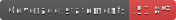
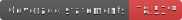

# Goal

This is a demonstration game to find all drone light show combinations, based on pre-determined formations & sounds.

The goal is to prove my ability to create SaaS (Software as a Service), using various frameworks with good practices.

## Testing & Code Quality

[](https://github.com/ostefanini/drawn-lights-demo/actions)

**api-nestjs** [](./apps/api-nestjs)  
**api-expressjs** [](./apps/api-expressjs)


## Live demo

The next.js + nestjs version is deployed at

https://demo-os.drawnlights.show

Observability is available at:


## Relation to Drawn Lights

Drawn lights was a marketplace for drone light show, an entrepreneurial project that aims to connect clients, designers and drone light show operators.

This demo is inspired from a previous demonstration.

# Technologies & SaaS concepts

## Shared packages

I use shared packages to factorize code between different tech versions, when possible.

### Data Transfer Objects (DTO)

With Zod, in [here](/packages/shared/)

### Database schemas

With Prisma, the ORM (Object Relational Mapping), [here](./packages/prisma/)

## #1st Frontend app, in vanilla React

React + Typescript + Mantine UI + Nginx [here](./apps/web-react/)

## #2nd Frontend app, in Next.js (deployed)

[here](./apps/web-nextjs)

## #1st Backend app, in Express.js

Node.js + Express.js + Typescript + lodash + supertest [here](./apps/api-expressjs/)

## #2nd Backend app, in NestJS (deployed)

Node.js + Nest.js + Typescript + lodash [here](./apps/api-nestjs/)

## Infra

CI/CD + Docker files/compose (hardened images)

# Development

## Quick Start

```bash
# Install dependencies
pnpm install

# Start development database
pnpm run stack:dev

# Run migrations
pnpm migrate

# Start any application
cd apps/api-nestjs && pnpm dev
cd apps/web-react && pnpm dev

# Stopping everything
pnpm run stack:dev:down
```

## Testing

Integration tests are available for the NestJS API. See [apps/api-nestjs/TESTING.md](./apps/api-nestjs/TESTING.md) for details.

### Running Tests Locally

```bash
# Start test database + migrations (one command)
pnpm test:db:up

# Run all tests
pnpm test

# Run tests with coverage
pnpm test:cov:badges  # Generates badges in apps/*/badges/

# Stop test database
pnpm test:db:down
```

### Coverage Badges

Coverage badges are automatically generated and updated by the CI/CD pipeline on each push to `main`. The badges are stored in the repository and reflect real-time coverage metrics.

## Available Scripts

From project root:

```bash
# Database
pnpm migrate              # Run Prisma migrations (dev)
pnpm migrate:deploy       # Apply migrations (prod)
pnpm showDb               # Open Prisma Studio

# Testing
pnpm stack:tests

# Code quality
pnpm lint                 # Lint all apps
pnpm test                 # Run all tests
pnpm typecheck            # Run all typechecks
```

# Contributors

| Name | Role |
|------|------|
| Karine | Product Manager |

# Hire me

oscar[dot]stefanini1[at]gmail.com